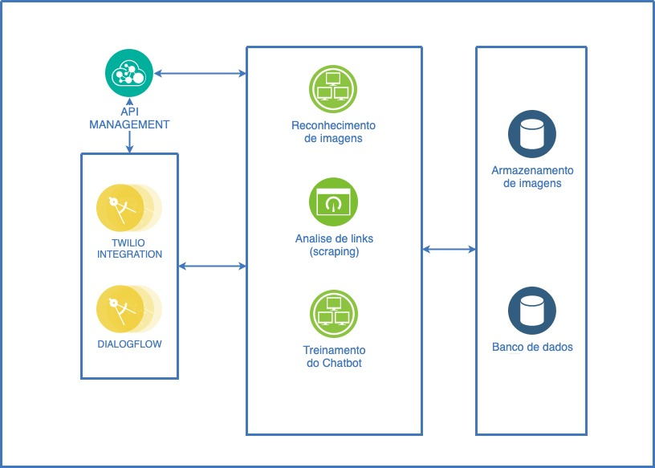
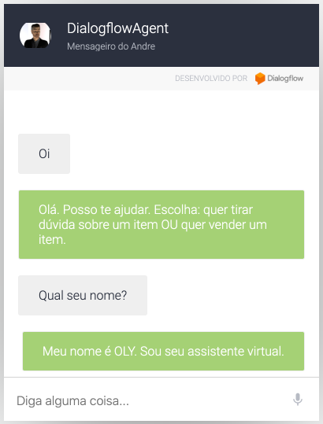

# OLY: Assistente Virtual

[Demonstração do assistente virtual](http://bit.ly/eq28olist)

[Vídeo do pitch](https://www.youtube.com/watch?v=-5I-7OoBm6Y)

## **Topologia da solução:**



A solução utiliza as melhores práticas de divisão de responsabilidades em microserviços.

O Mobile App para Realidade Aumentada foi desenvolvido em react native por outro integrante da equipe. [Link do repositório](https://github.com/patrickbattisti/olist-augmented-reality) 

---

## **Tecnologias e Stacks utilizadas:**

`Twilio: integração com o WhatsApp para receber solicitações e posterior resposta.`

`Sumerian: criação da interface 3D do assistente virtual.`

`Dialogflow: motor do chatbot utilizado para respostas de dúvidas.`

`Python Backend serverless: funções responsáveis pelas funcionalidades da solução.`

---

## **Microserviços da solução **

>`Reconhecimento de imagens:`

```Descrição:
```

>`Scrap:`

```Descrição:
```

>`Chatbot:`

```Descrição:
```

>`Treinamento automatizado do Chatbot:`

```Descrição:
```

>`Comunicação do Assistente em diversos canais: Whatsapp, Facebook, Twitter`

```Descrição:
```

>`Armazenamento das imagens:`

```Descrição:
```

---
### **Demonstrativo da aplicação Chatbot:**

[Demonstração do módulo Chatbot utilizado pelo OLY](https://bot.dialogflow.com/tonanuvem)



---
